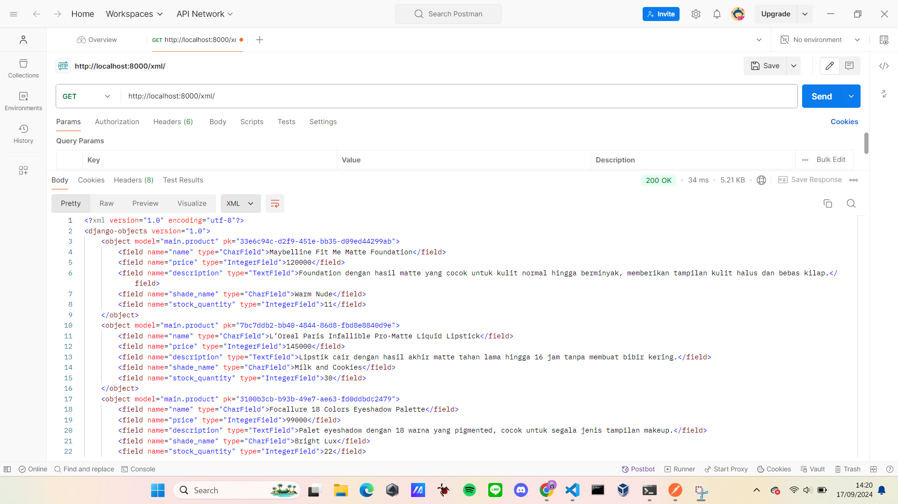
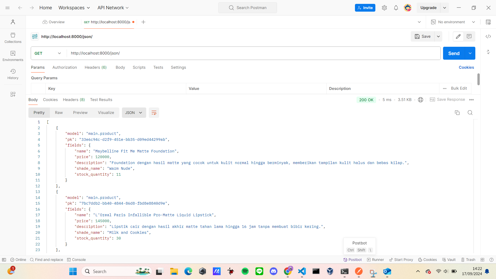
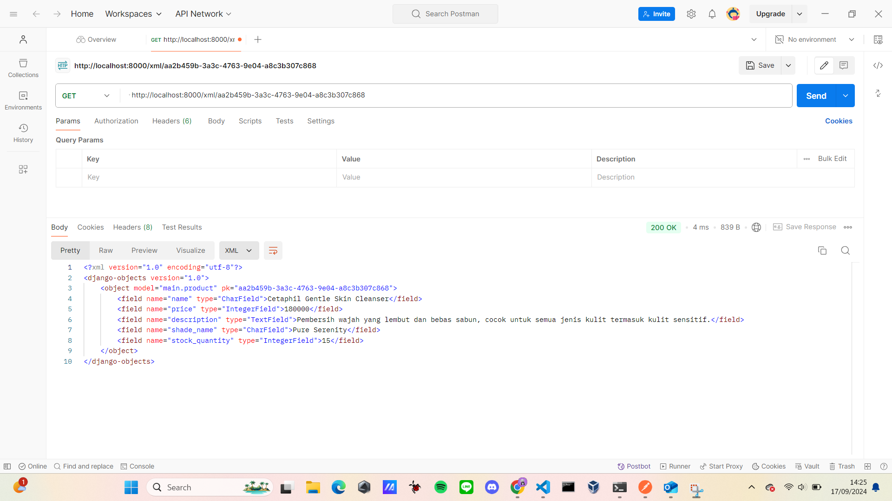
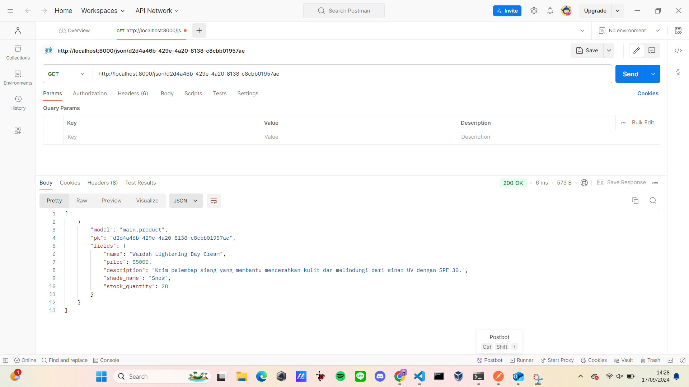

PWS : http://yemima-clara31-luxuryglow.pbp.cs.ui.ac.id

# Cara Implementasi Checklist secara step by step : 
1. Membuat repositori baru di GitHub dengan nama Luxury-Glow dan membuat berkas README dalam direktori lokal proyek.
2. Menghubungkan repositori lokal dengan repositori di github. 
3. Melakukan cloning repositori ke komputer lokal dengan url clone eccomerce.
4. Membuat dan mengaktifkan virtual environment pada command prompt.
5. Membuat berkas requirements.txt dan menambahkan beberapa dependencies, seperti berikut : 
    django
    gunicorn
    whitenoise
    psycopg2-binary
    requests
    urllib3
    Pillow
6. Melakukan instalasi terhadap dependencies dan membuat proyek django bernama Luxury_Glow.
7. Mengkonfigurasi proyek dan menjalankan server dengan menambahkan string pada ALLOWED HOSTS di settings.py untuk keperluan deployment, seperti berikut : 
    ALLOWED_HOSTS = ["localhost", "127.0.0.1"]
8. Menambahkan berkas .gitignore untuk menentukan berkas dan direktori yang harus diabaikan oleh Git.
9. Membuat aplikasi main dalam proyek Luxury-Glow dan mendaftarkan aplikasi main ke dalam proyek. 
10. Mencoba membuka berkas HTML di peramban web.
11. Menambahkan atribut atribut yang diperlukan pada eccomerce Luxury Glow pada berkas models.py, yaitu :  name, price, description, image, shade_name, dan stock quantity.
12. Membuat migrasi model dengan perintah "python manage.py makemigrations" dan menerapkan migrasi ke dalam basis data lokal dengan perintah "python manage.py migrate".
13. Mengintegrasikan komponen MVT dengan menambahkan baris import di paling atas berkas views.py dengan menambahkan berkas dan menambahkan fungsi show_main di bawah impor.
14. Memodifikasi template main.html dan mengisi dengan atribut yang diperlukan pada eccomerce dan menyesuaikan peletakkan judul dan isiannya serta melakukan setting di warna tulisan dan backgroundnya.
15. Mengonfigurasi routing url pada aplikasi main pada berkas urls.py di dalam direktori main.
16. Mengonfigurasi routing url proyek untuk menghubungkan ke tampilan main dengan mengimpor fungsi include pada berkas urls.py yang bukan di direktori aplikasi main.
17. Menjalankan django dengan perintah "python manage.py runserver" dan membukanya pada peramban web.
18. Melakukan deployment dengan menambahkan URL deployment PWS pada ALLOWED HOSTS dengan username sso dan nama proyek.
19. Melakukan push dengan perintah "git push pws master" dan menununggu status running hingga successful, kemudian project yang sudah dibuat sudah dapat diakses.

# Bagan yang berisi request client ke web aplikasi berbasis Django beserta responnya dan penjelasan kaitan antara urls.py, views.py, models.py, dan berkas html.

# Jelaskan fungsi git dalam pengembangan perangkat lunak!
Beberapa fungsi utama Git dalam pengembangan perangkat lunak :
1) Melacak setiap perubahan yang dibuat pada kode sumber selama pengembangan. Setiap perubahan dapat direkam dalam bentuk commit, yang berisi informasi tentang perubahan tersebut, seperti apa yang diubah, oleh siapa, dan kapan.
2) Git memfasilitasi kolaborasi antar anggota tim pengembang dengan mengizinkan beberapa orang untuk bekerja pada bagian yang sama dari sebuah proyek secara bersamaan. 
3) Git sering digunakan bersama dengan alat Continuous Integration/Continuous Deployment (CI/CD). Setiap kali ada perubahan kode yang dikirim ke repositori, pengujian otomatis dan proses build dapat dijalankan untuk memastikan kualitas dan konsistensi kode.
4) Git memungkinkan pengembang untuk membuat berbagai versi kode secara paralel menggunakan branching. Ini memudahkan pengelolaan fitur baru, perbaikan bug, dan eksperimen tanpa mengganggu kode utama (main branch). Setelah fitur atau perbaikan selesai, mereka dapat digabungkan kembali ke branch utama.

# Mengapa framework Django dijadikan permulaan pembelajaran pengembangan perangkat lunak?
Menurut saya, Framework Django dijadikan permulaan pembelajaran dikarenakan Kemudahan penggunaan karena dokumentasiya lengkap dan berkualitas dan memiliki arsitektur yang terorganisir dengan baik (MVT - Model - View - Template) yang terstruktur dengan baik sehingga pemula dapat memahami bagaimana komponen aplikasi web berinteraksi satu sama lain. Django juga memiliki komunitas user dan developer yang aktif sehingga pemula dapat mudah menemukan jawaban atas pertanyaan mereka. Django juga memungkinkan pemula yang ingin menjadi developer untuk membuat aplikasi web fungsional dengan cepat dikarenakan kerangka kerjanya dilengkapi panel admin otomatis yang memungkinkan pengembang untuk mengelola data aplikasi tanpa menulis banyak kode. 

# Mengapa model pada Django disebut sebagai ORM?
Model pada Django disebut sebagai ORM dikarenakan memungkinkan pengembang untuk berinteraksi dengan database menggunakan objek Python dan metode, tanpa perlu menulis query SQL. Django ORM akan secara otomatis menerjemahkan operasi yang dilakukan pada objek Python menjadi perintah SQL yang setara. Django disebut ORM juga karena menyediakan interface berbasis python untuk melakukan operasi CRUD (Create, Read, Uodate, Delete) pada data dalam database. 

# Jelaskan mengapa kita memerlukan data delivery dalam pengimplementasian sebuah platform?
Kita memerlukan data delivery dalam pengimplementasian platform karena data sering kali perlu dipindahkan dari satu bagian sistem ke bagian lainnya, atau dari server ke client, agar aplikasi dapat berfungsi dengan baik. Data delivery juga memungkinkan berbagai sistem yang menggunakan format data berbeda, seperti XML dan JSON, untuk saling berkomunikasi. Ini membantu integrasi dengan aplikasi lain yang mungkin memiliki format data yang berbeda. Dengan data delivery, pengguna dapat melihat informasi yang diperbarui atau dinamis di aplikasi mereka. Contohnya, ketika pengguna mengisi formulir atau menambahkan data, sistem dapat memproses data tersebut dan menampilkannya kembali dengan cepat dalam format seperti HTML, XML, atau JSON.

# Menurutmu, mana yang lebih baik antara XML dan JSON? 
Perbandingan antara XML dan JSON:
- JSON lebih ringan dan lebih cepat: JSON memiliki struktur yang lebih sederhana dan tidak memerlukan tag pembuka dan penutup seperti XML, sehingga ukuran file JSON biasanya lebih kecil dan proses parsing lebih cepat.
- JSON lebih mudah dibaca oleh manusia dan mesin: JSON memiliki struktur yang lebih ringkas dan lebih mudah dibaca, terutama dalam format key-value yang mirip dengan objek di JavaScript, yang membuatnya lebih intuitif bagi banyak developer.
# Mengapa JSON lebih populer dibandingkan XML?
- Efisiensi dan performa: Karena ukurannya yang lebih kecil dan parsing yang lebih cepat, JSON lebih disukai dalam aplikasi web modern yang membutuhkan komunikasi data yang cepat dan ringan.
- Kompatibilitas dengan JavaScript: JSON secara native mendukung JavaScript, sehingga lebih mudah diintegrasikan dalam aplikasi berbasis web yang banyak menggunakan JavaScript.
- Banyaknya dukungan oleh API: Sebagian besar API modern mendukung atau menggunakan JSON sebagai format utama untuk pertukaran data karena kemudahan integrasi dan efisiensinya.

# Jelaskan fungsi dari method is_valid() pada form Django 
Method is_valid() ini digunakan untuk memeriksa apakah data yang dimasukkan ke dalam form Django valid atau tidak. Ketika is_valid() dipanggil, Django akan melakukan validasi terhadap semua field dalam form sesuai dengan aturan atau constraints yang telah didefinisikan dalam model atau form tersebut. Jika semua data valid, method ini akan mengembalikan nilai True. Jika terdapat kesalahan pada data yang diinput, method ini akan mengembalikan False dan menyediakan pesan error yang dapat ditampilkan kepada pengguna.
# Mengapa kita membutuhkan method tersebut?
- Memastikan integritas data : Method ini penting untuk memastikan bahwa data yang diinput oleh pengguna sesuai dengan aturan yang telah ditentukan (misalnya format price yang benar, panjang minimal atau maksimal teks, angka yang valid, dll.).
- Mencegah kesalahan : Dengan adanya validasi melalui is_valid(), kita dapat mencegah penyimpanan data yang tidak sesuai, sehingga mengurangi risiko kesalahan sistem.

# Mengapa kita membutuhkan csrf_token saat membuat form di Django? 
Kita membutuhkan csrf_token saat membuat form di Django untuk melindungi aplikasi dari serangan CSRF (Cross-Site Request Forgery). CSRF adalah jenis serangan di mana penyerang dapat membuat pengguna yang terautentikasi secara tidak sengaja mengirimkan permintaan berbahaya ke server tanpa sepengetahuan mereka. Dengan menambahkan csrf_token, Django menghasilkan token unik yang dimasukkan ke dalam setiap form dan diperiksa oleh server saat menerima permintaan POST.
# Apa yang dapat terjadi jika kita tidak menambahkan csrf_token pada form Django? 
Jika csrf_token tidak ditambahkan, aplikasi menjadi rentan terhadap serangan CSRF, di mana penyerang dapat memanfaatkan sesi aktif pengguna untuk mengirimkan permintaan yang tidak sah. Tanpa validasi token, server akan menerima dan memproses permintaan tersebut seolah-olah permintaan tersebut valid, yang dapat berakibat pada modifikasi data atau tindakan berbahaya lainnya.
# Bagaimana hal tersebut dapat dimanfaatkan oleh penyerang?
Penyerang dapat membuat halaman web yang secara diam-diam mengirimkan permintaan berbahaya (misalnya, menghapus akun atau mengubah data penting) ke aplikasi Django menggunakan sesi pengguna yang sudah terautentikasi, tanpa persetujuan atau sepengetahuan pengguna tersebut. Dengan menggunakan token CSRF, Django memastikan bahwa permintaan yang diterima berasal dari sumber yang sah (form dalam aplikasi) dan bukan dari sumber eksternal.

# Jelaskan bagaimana cara kamu mengimplementasikan checklist di atas secara step-by-step (bukan hanya sekadar mengikuti tutorial).
1) Membuat direktori templates pada root folder dan membuat berkas base.html untuk template dasar yang dapat digunakan sebagai kerangka umum untuk halaman web lainnya di dalam proyek. Lalu menambahkan variabel templates dengan "BASE_DIR / 'templates'". Lalu mengubah kode main.html dengan mengextends base.html agar base.html sebagai template utama
2) Menambahkan "import uuid" untuk mengubah primary key dari integer menjadi uuid, lalu melakukan migrasi.
3) Membuat berkas forms.py untuk membuat struktur form yang dapat menerima data Product Entry baru, setelah itu menambahkan import redirect pada berkas views.py dan membuat fungsi baru create_product_entry yang menerima parameter request untuk menghasilkan form yang dapat menambahkan data Product Entry secara otomatis ketika  data di-submit dari form. 
4) Menambahkan fungsi ProductEntry.objects.all() pada berkas views.py yang akan digunakan untuk mengambil seluruh objek ProductEntry yang tersimpan pada database, lalu menambahkan import fungsi create_product_entry pada urls.py.
5) Menambahkan path URL ke dalam variabel url patterns pada urls.py di main untuk mengakses fungsi create_product_entry. Setelah itu, membuat berkas html baru dengan nama create_product_entry.
6) Menambahkan kode "% block content %" untuk menampilkan data product dalam bentuk tabel serta tombol "Add New Skincare atau Product"
7) Menambahkan import HttpResponse dan Serializer pada berkas views.py dan membuat sebuah fungsi baru dengan nama show_xml serta membuat sebuah variabel di dalam fungsi tersebut yang menyimpan hasil query dari seluruh data yang ada pada ProductEntry. Lalu, menambahkan return function berupa HttpResponse yang berisi parameter data hasil query yang sudah diserialisasi menjadi XML dan parameter content_type="application/xml.
8) Menambahkan import fungsi show_xml pada urls.py dan menambahkan path url ke dalam urlpatterns untuk mengakses fungsi yang sudah diimpor sebelumnya.
9) Membuat sebuah fungsi baru yang menerima parameter request dengan nama show_json dan menambahkan return function berupa HttpResponse yang berisi parameter data hasil query yang sudah diserialisasi menjadi JSON dan parameter content_type="application/json" serta menambahkan fungsi show_json pada urls.py. Lalu, menambahkan show_json pada path url.
10) Membuat dua fungsi baru, yaitu show_xml_by_id dan show_json_by_id. Lalu, membuat variabel di dalam fungsi buat nyimpen hasil query dari data dengan id tertentu yang ada pada ProductEntry. Setelah itu, menambahkan return function berupa HttpResponse yang berisi parameter data hasil query yang sudah diserialisasi menjadi JSON atau XML dan parameter content_type dengan value "application/xml" (untuk format XML) atau "application/json" (untuk format JSON).
11) Menambahkan import fungsi show_xml_by_id dan show_json_by_id dan menaambahkan path url tersebut untuk mengakses fungsi yang sudah diimpor.
12) Melihat data lewat Postman dengan method get dilengkapi dengan url xml dan json untuk mengetes apakah data terkirimkan dengan baik serta xml by id dan json by id untuk mengetes fungsi pengambilan data Product Entry berdasarkan ID.
13) Melakukan push ke pws secara otomatis menggunakan github actions, yaitu dengan membuat subdirektori .github dan di dalamnya diletakkan subdirektori bernama workflows. Lalu, membuat berkas deploy.yml. Selanjutnya, pada repositori di github di bagian actions pada settings mengisi nama dengan PWS_URL dan mengisi secret dengan format yang telah ditentukan. Setelah itu, menambahkan kode url pws pada settings.py dan terakhir melakukan git add, commit, dan push serta menunggu indikator kuning berubah menjadi indikator centang hijau.

# Hasil akses URL XML

# Hasil akses URL JSON

# Hasil akses URL XML by ID

# Hasil akses URL JSON by ID

